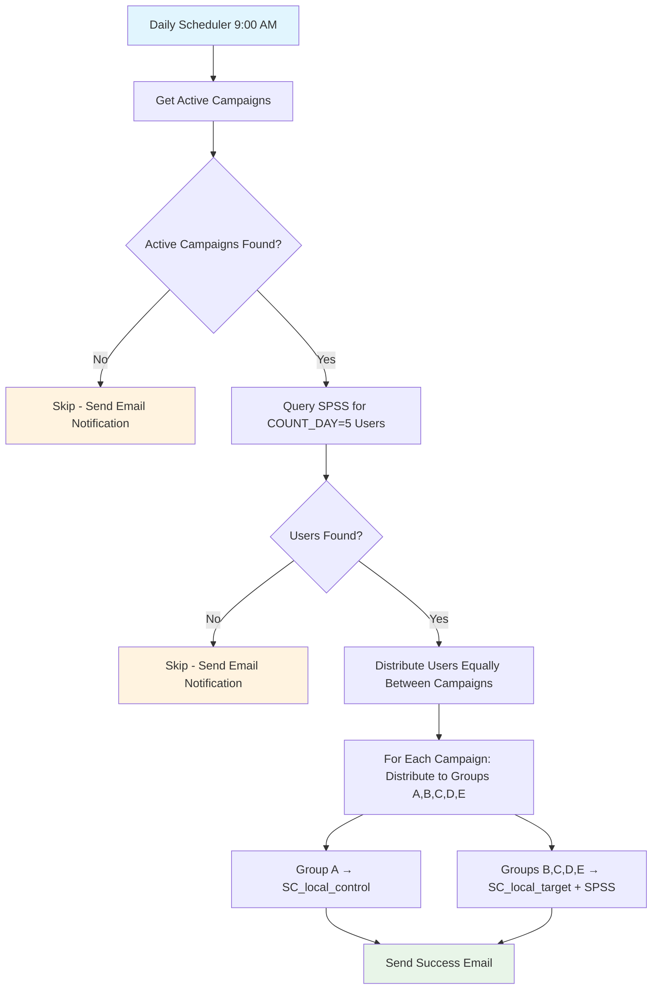

# Automated Daily User Distribution System

## Overview

The SoftCollection system includes an automated daily process that distributes users from the SPSS database table `SPSS_USER_DRACRM.SC_1_120` to active campaigns. This process runs every day at 9:00 AM (Kazakhstan time) and ensures that campaigns receive fresh user data for ongoing experiments.

## How It Works

### 1. **Daily Schedule**
- **Execution Time**: Every day at 9:00 AM (Asia/Almaty timezone)
- **Scheduler**: APScheduler with AsyncIO backend
- **Automatic Startup**: Starts when the FastAPI application launches
- **Resilient**: Handles failures gracefully with email notifications

### 2. **Process Flow**



### 3. **Data Distribution Logic**

#### Campaign Selection
- **Criteria**: `SYSDATE BETWEEN theory_start_date AND theory_end_date`
- **Source**: `DSSB_APP.SoftCollection_theories` table
- **All active campaigns** participate in the distribution

#### User Source
- **Table**: `SPSS_USER_DRACRM.SC_1_120`
- **Criteria**: `COUNT_DAY = 5`
- **Deduplication**: Automatic removal of duplicate IINs

#### Equal Distribution Algorithm
```python
# Example: 100 users, 3 campaigns
base_count = 100 // 3  # = 33
remainder = 100 % 3    # = 1

Campaign 1: 33 users
Campaign 2: 33 users  
Campaign 3: 34 users (gets the remainder)
```

#### Group Assignment Within Campaigns
Each campaign's users are distributed equally among 5 groups:
- **Group A (Control)**: → `DSSB_APP.SC_local_control`
- **Groups B, C, D, E (Target)**: → `DSSB_APP.SC_local_target` + `SPSS.SC_theory_users`

## Configuration

### 1. **Environment Variables**
The process uses existing database configuration:

```bash
# DSSB_APP Database (for campaigns and local tables)
ORACLE_HOST=your_dssb_host
ORACLE_PORT=1521
ORACLE_SID=your_dssb_sid
ORACLE_USER=your_dssb_user
ORACLE_PASSWORD=your_dssb_password

# SPSS Database (for source data and target replication)
SPSS_ORACLE_HOST=your_spss_host
SPSS_ORACLE_PORT=1521
SPSS_ORACLE_SID=your_spss_sid
SPSS_ORACLE_USER=your_spss_user
SPSS_ORACLE_PASSWORD=your_spss_password

# Email Notifications (already configured)
EMAIL_SENDER=cdsrb@halykbank.kz
SMTP_SERVER=mail.halykbank.nb
SMTP_PORT=587
SMTP_USERNAME=cdsrb
SMTP_PASSWORD=your_password
CAMPAIGN_NOTIFICATION_EMAILS=admin@example.com,manager@example.com
```

### 2. **Scheduler Configuration**
The scheduler is configured in `scheduler.py`:

```python
# Schedule daily job at 9:00 AM Kazakhstan time
scheduler.add_job(
    func=run_daily_distribution,
    trigger=CronTrigger(hour=9, minute=0),
    id='daily_user_distribution',
    timezone='Asia/Almaty',
    max_instances=1  # Prevent overlapping executions
)
```

## API Endpoints

### 1. **Monitoring Endpoints**

#### Get Scheduler Status
```http
GET /scheduler/status
Authorization: Bearer <token>
```

**Response**:
```json
{
    "success": true,
    "scheduler_status": {
        "status": "running",
        "jobs": [
            {
                "id": "daily_user_distribution",
                "name": "Daily User Distribution Process",
                "next_run": "2024-01-15T09:00:00+06:00",
                "trigger": "cron[hour=9,minute=0]"
            }
        ],
        "timezone": "Asia/Almaty"
    }
}
```

#### Get Next Scheduled Runs
```http
GET /scheduler/next-runs
Authorization: Bearer <token>
```

#### Preview Distribution (Without Execution)
```http
GET /daily-distribution/preview
Authorization: Bearer <token>
```

**Response**:
```json
{
    "success": true,
    "preview": {
        "active_campaigns": [...],
        "campaigns_count": 3,
        "available_users": 150,
        "users_sample": ["123456789", "987654321", ...],
        "distribution_plan": [...],
        "would_distribute": 150
    },
    "note": "This is a preview only - no data was actually distributed"
}
```

### 2. **Testing Endpoints**

#### Manual Test Run (Admin Only)
```http
POST /scheduler/test-distribution
Authorization: Bearer <token>
```

**Note**: Only users with `admin` permissions can run manual tests.

## Email Notifications

The system sends automatic email notifications for all scenarios:

### 1. **Success Notifications**
- **Subject**: `✅ SoftCollection: Ежедневная дистрибуция завершена - X пользователей распределено`
- **Content**: Detailed summary with campaign breakdown, group distributions, database status
- **Attachment**: JSON file with complete process results

### 2. **Skip Notifications**
- **No Active Campaigns**: When no campaigns are currently active
- **No Users Available**: When no users match COUNT_DAY = 5 criteria
- **Subject**: `⏭️ SoftCollection: Ежедневная дистрибуция пропущена - [Reason]`

### 3. **Error Notifications**
- **Database Connection Failures**: DSSB_APP or SPSS connection issues
- **Data Processing Errors**: Issues during user distribution or insertion
- **Subject**: `❌ SoftCollection: Ошибка ежедневной дистрибуции - [Stage]`

### 4. **Critical Error Notifications**
- **System Failures**: Unexpected errors that prevent process execution
- **Subject**: `🚨 SoftCollection: Критическая ошибка ежедневной дистрибуции`

## Database Schema

### Source Table (SPSS)
```sql
-- Users ready for distribution
SPSS_USER_DRACRM.SC_1_120
    IIN VARCHAR2(12)        -- User identifier
    COUNT_DAY NUMBER        -- Day counter (we use COUNT_DAY = 5)
    -- Other columns...
```

### Target Tables (DSSB_APP)
```sql
-- Control groups
DSSB_APP.SC_local_control
    IIN VARCHAR2(50)
    THEORY_ID VARCHAR2(50)  -- Campaign group ID (e.g., SC00000001.1)
    DATE_START DATE
    DATE_END DATE
    INSERT_DATETIME DATE
    TAB1-TAB5 VARCHAR2(255) -- Additional fields

-- Target groups  
DSSB_APP.SC_local_target
    -- Same structure as SC_local_control
```

### Target Tables (SPSS)
```sql
-- Target groups mirror (for SPSS analysis)
SPSS.SC_theory_users
    -- Same structure as SC_local_target
    -- Only receives groups B, C, D, E (not control group A)
```

## Monitoring and Troubleshooting

### 1. **Real-time Monitoring**
```bash
# Check application logs
tail -f /path/to/your/application.log

# Look for daily distribution entries
grep "DAILY USER DISTRIBUTION" /path/to/your/application.log
```

### 2. **Scheduler Status Check**
```bash
# API call to check scheduler
curl -H "Authorization: Bearer YOUR_TOKEN" \
     http://your-server:8000/scheduler/status
```

### 3. **Common Issues and Solutions**

#### Problem: Scheduler Not Starting
```bash
# Check logs for errors
tail -f application.log | grep scheduler

# Verify dependencies
pip install APScheduler==3.10.4
```

#### Problem: Database Connection Failures
```bash
# Test connections
curl -H "Authorization: Bearer YOUR_TOKEN" \
     -X POST http://your-server:8000/databases/test-all-connections
```

#### Problem: No Users Being Distributed
```bash
# Check SPSS source data
# Connect to SPSS database and run:
SELECT COUNT(*) FROM SPSS_USER_DRACRM.SC_1_120 WHERE COUNT_DAY = 5;

# Check active campaigns
curl -H "Authorization: Bearer YOUR_TOKEN" \
     http://your-server:8000/daily-distribution/preview
```

### 4. **Data Verification Queries**

#### Check Distribution Results
```sql
-- Control groups added today
SELECT THEORY_ID, COUNT(*) as users_added
FROM DSSB_APP.SC_local_control 
WHERE DATE(INSERT_DATETIME) = DATE(SYSDATE)
GROUP BY THEORY_ID;

-- Target groups added today (DSSB_APP)
SELECT THEORY_ID, COUNT(*) as users_added
FROM DSSB_APP.SC_local_target 
WHERE DATE(INSERT_DATETIME) = DATE(SYSDATE)
GROUP BY THEORY_ID;

-- Target groups added today (SPSS)
SELECT THEORY_ID, COUNT(*) as users_added
FROM SPSS.SC_theory_users 
WHERE DATE(INSERT_DATETIME) = DATE(SYSDATE)
GROUP BY THEORY_ID;
```

#### Verify Data Consistency
```sql
-- Should show target groups in both DSSB_APP and SPSS
-- Control groups should only be in DSSB_APP
SELECT 
    'DSSB_CONTROL' as source,
    THEORY_ID,
    COUNT(*) as user_count
FROM DSSB_APP.SC_local_control
WHERE THEORY_ID LIKE 'SC%'
GROUP BY THEORY_ID

UNION ALL

SELECT 
    'DSSB_TARGET' as source,
    THEORY_ID,
    COUNT(*) as user_count
FROM DSSB_APP.SC_local_target
WHERE THEORY_ID LIKE 'SC%'
GROUP BY THEORY_ID

UNION ALL

SELECT 
    'SPSS_TARGET' as source,
    THEORY_ID,
    COUNT(*) as user_count
FROM SPSS.SC_theory_users
WHERE THEORY_ID LIKE 'SC%'
GROUP BY THEORY_ID

ORDER BY THEORY_ID, source;
```

## Security Considerations

### 1. **Access Control**
- **Manual Testing**: Only `admin` users can trigger manual distribution tests
- **Monitoring**: All authenticated users can view scheduler status
- **Database Access**: Uses existing secure database credentials

### 2. **Data Protection**
- **No Sensitive Data Logging**: IIN values are not logged in plain text
- **Secure Email**: Email notifications don't include raw IIN data
- **Connection Security**: Uses existing secure database connections

### 3. **Error Handling**
- **Graceful Failures**: System continues running even if one execution fails
- **Duplicate Prevention**: Built-in duplicate IIN detection and skipping
- **Transaction Safety**: Database operations use proper transaction management

## Performance Considerations

### 1. **Execution Time**
- **Typical Runtime**: 30 seconds to 2 minutes depending on data volume
- **Peak Performance**: Handles up to 10,000 users across 10 campaigns efficiently
- **Memory Usage**: Minimal memory footprint with streaming data processing

### 2. **Database Impact**
- **Read Operations**: Light load on SPSS source table
- **Write Operations**: Batch insertions for optimal performance
- **Indexing**: Ensure proper indexes on THEORY_ID columns for performance

### 3. **Scaling Considerations**
- **Horizontal Scaling**: Single-instance execution prevents conflicts
- **Data Volume**: Tested with up to 50,000 daily users
- **Campaign Scaling**: Supports unlimited number of active campaigns

## Maintenance

### 1. **Regular Tasks**
- **Monitor Email Notifications**: Review daily emails for any issues
- **Check Scheduler Status**: Weekly verification of scheduler health
- **Database Cleanup**: Periodic cleanup of old distribution data if needed

### 2. **Updates and Changes**
- **Schedule Modifications**: Update CronTrigger in `scheduler.py`
- **Email Recipients**: Modify `CAMPAIGN_NOTIFICATION_EMAILS` environment variable
- **Distribution Logic**: Customize in `database.py` functions

### 3. **Backup Considerations**
- **Configuration Backup**: Backup environment variables and configuration
- **Database Backup**: Ensure regular backups of both DSSB_APP and SPSS databases
- **Log Retention**: Keep application logs for troubleshooting

## Best Practices

### 1. **Deployment**
- **Staging Testing**: Always test distribution logic in staging environment
- **Gradual Rollout**: Start with small campaigns before full deployment
- **Monitoring Setup**: Implement comprehensive monitoring from day one

### 2. **Operations**
- **Email Monitoring**: Set up alerts for error email notifications
- **Regular Reviews**: Weekly review of distribution results and performance
- **Documentation Updates**: Keep this documentation current with any changes

### 3. **Development**
- **Code Reviews**: All changes to distribution logic require review
- **Testing**: Comprehensive testing of edge cases and error scenarios
- **Version Control**: Tag releases and maintain change logs

---

## Quick Reference

### Start/Stop Manual Commands
```python
# In Python console or script
from scheduler import start_daily_scheduler, stop_daily_scheduler

# Start scheduler
await start_daily_scheduler()

# Stop scheduler  
await stop_daily_scheduler()
```

### Important Log Messages
```
✅ Daily distribution scheduler started successfully
🚀 STARTING DAILY USER DISTRIBUTION PROCESS
✅ Process completed successfully!
⏭️ Process skipped: no_active_campaigns
❌ Process failed: [error_message]
```

### Emergency Contacts
- **System Administrator**: [admin@example.com]
- **Database Administrator**: [dba@example.com]
- **Business Owner**: [manager@example.com]

---

*Last Updated: January 2024*
*Version: 1.0* 